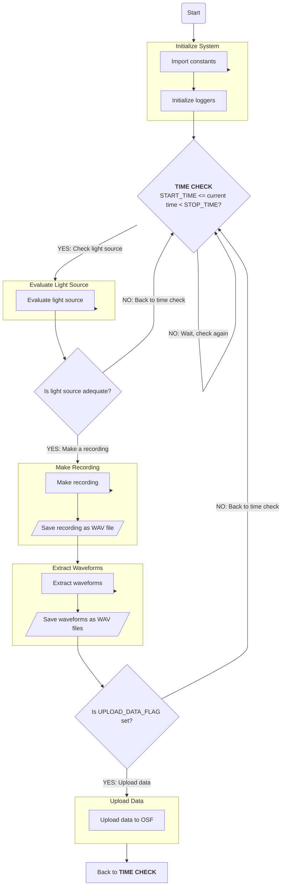

```mermaid
%%---
%%config:
%%  theme: redux
%%---
flowchart TD
    start("Start")
    subgraph sg_initialize["Initialize System"]
        import_constants["Import constants"]
        initialize_loggers["Initialize loggers"]
    end
    check_time_of_day{"<b>TIME CHECK</b><br/>START_TIME &lt;= current time &lt; STOP_TIME?"}
    subgraph sg_evaluate_light_source["Evaluate Light Source"]
        evaluate_light_source["Evaluate light source"]
    end
    light_source_adequate{"Is light source adequate?"}
    subgraph sg_make_recording["Make Recording"]
        make_recording["Make recording"]
        save_recording[/"Save recording as WAV file"/]
    end
    subgraph sg_extract_waveforms["Extract Waveforms"]
        extract_waveforms["Extract waveforms"]
        save_waveforms[/"Save waveforms as WAV files"/]
    end
    UPLOAD_DATA_flag_is_set{"Is UPLOAD_DATA_FLAG set?"}
    subgraph sg_upload_data["Upload Data"]
        upload_data["Upload data to OSF"]
    end

    %% Main vertical flow
    start --> sg_initialize
    sg_initialize --> import_constants --> initialize_loggers
    initialize_loggers --> check_time_of_day
    check_time_of_day -- "NO: Wait, check again" --> check_time_of_day
    check_time_of_day -- "YES: Check light source" --> sg_evaluate_light_source
    sg_evaluate_light_source --> evaluate_light_source
    evaluate_light_source --> light_source_adequate
    light_source_adequate -- "NO: Back to time check" --> check_time_of_day
    light_source_adequate -- "YES: Make a recording" --> sg_make_recording
    sg_make_recording --> make_recording --> save_recording
    save_recording --> sg_extract_waveforms
    sg_extract_waveforms --> extract_waveforms --> save_waveforms
    save_waveforms --> UPLOAD_DATA_flag_is_set
    UPLOAD_DATA_flag_is_set -- "YES: Upload data" --> sg_upload_data
    UPLOAD_DATA_flag_is_set -- "NO: Back to time check" --> check_time_of_day
    %% The following line is a hack to force Mermaid to position sg_upload_data
    %% at the bottom of the flowchart.
    sg_upload_data --> END["Back to <b>TIME CHECK</b>"]
```
